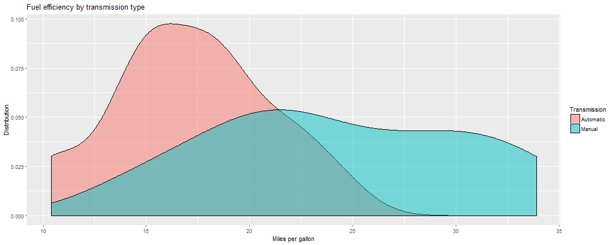

<style>


/* slide titles */
.reveal h3 { 
  font-size: 75px;
  color: black;
}

.small-code pre code {
  font-size: 1em;
}
.footer {
    color: red; background: #E8E8E8;
    position: fixed; top: 90%;
    text-align:left; width:100%;
}

.footnote {
    color: black;
    position: fixed; top: 92%;
    text-align:left; width:100%;
    font-size: 1em;
}
</style>


R training
========================================================
font-family: 'Helvetica'
width: 1200
height: 900


   
<div style="color:white ;text-align: right"> Caroline Gao & Tyler Lane </div>


Welcome to the first SPHPM R Group Meeting!
========================================================
* Who I am - Tyler Lane
  - Post-doc in the Insurance, Work and Health Group
  - R amateur (~2 years)
  - SPSS refugee
  - tyler.lane@monash.edu
* I'll talk about
  - SPHPM Group
  - Reasons to use R
  - Some simple code showing capabilities
  - Unsolicited R learning advice


SPHPM R Group purpose
========================================================
* Create a community of R users
* Provide some training
* Share resources
* Tips on best practice


What stats packages do you currently use?
========================================================
* MS Excel 
* SPSS
* STATA
* SAS
* Python
* R
* Something else?


Why use R?
========================================================
class: small-code
* It's free!
  - Skill you can carry outside academia
* Extremely flexible
  - User-developed packages to do just about anything
* Vibrant, passionate, and supportive user community
* Easy to share code
* Increasingly popular
* Built-in datasets to practice with

```r
# To see this, enter this code in your console
ls("package:datasets")
```


Built-in package: mtcars
========================================================
class:small-code

```
                     mpg cyl  disp  hp drat    wt  qsec vs am gear carb
Mazda RX4           21.0   6 160.0 110 3.90 2.620 16.46  0  1    4    4
Mazda RX4 Wag       21.0   6 160.0 110 3.90 2.875 17.02  0  1    4    4
Datsun 710          22.8   4 108.0  93 3.85 2.320 18.61  1  1    4    1
Hornet 4 Drive      21.4   6 258.0 110 3.08 3.215 19.44  1  0    3    1
Hornet Sportabout   18.7   8 360.0 175 3.15 3.440 17.02  0  0    3    2
Valiant             18.1   6 225.0 105 2.76 3.460 20.22  1  0    3    1
Duster 360          14.3   8 360.0 245 3.21 3.570 15.84  0  0    3    4
Merc 240D           24.4   4 146.7  62 3.69 3.190 20.00  1  0    4    2
Merc 230            22.8   4 140.8  95 3.92 3.150 22.90  1  0    4    2
Merc 280            19.2   6 167.6 123 3.92 3.440 18.30  1  0    4    4
Merc 280C           17.8   6 167.6 123 3.92 3.440 18.90  1  0    4    4
Merc 450SE          16.4   8 275.8 180 3.07 4.070 17.40  0  0    3    3
Merc 450SL          17.3   8 275.8 180 3.07 3.730 17.60  0  0    3    3
Merc 450SLC         15.2   8 275.8 180 3.07 3.780 18.00  0  0    3    3
Cadillac Fleetwood  10.4   8 472.0 205 2.93 5.250 17.98  0  0    3    4
Lincoln Continental 10.4   8 460.0 215 3.00 5.424 17.82  0  0    3    4
Chrysler Imperial   14.7   8 440.0 230 3.23 5.345 17.42  0  0    3    4
Fiat 128            32.4   4  78.7  66 4.08 2.200 19.47  1  1    4    1
Honda Civic         30.4   4  75.7  52 4.93 1.615 18.52  1  1    4    2
Toyota Corolla      33.9   4  71.1  65 4.22 1.835 19.90  1  1    4    1
Toyota Corona       21.5   4 120.1  97 3.70 2.465 20.01  1  0    3    1
Dodge Challenger    15.5   8 318.0 150 2.76 3.520 16.87  0  0    3    2
AMC Javelin         15.2   8 304.0 150 3.15 3.435 17.30  0  0    3    2
Camaro Z28          13.3   8 350.0 245 3.73 3.840 15.41  0  0    3    4
Pontiac Firebird    19.2   8 400.0 175 3.08 3.845 17.05  0  0    3    2
Fiat X1-9           27.3   4  79.0  66 4.08 1.935 18.90  1  1    4    1
Porsche 914-2       26.0   4 120.3  91 4.43 2.140 16.70  0  1    5    2
Lotus Europa        30.4   4  95.1 113 3.77 1.513 16.90  1  1    5    2
Ford Pantera L      15.8   8 351.0 264 4.22 3.170 14.50  0  1    5    4
Ferrari Dino        19.7   6 145.0 175 3.62 2.770 15.50  0  1    5    6
Maserati Bora       15.0   8 301.0 335 3.54 3.570 14.60  0  1    5    8
Volvo 142E          21.4   4 121.0 109 4.11 2.780 18.60  1  1    4    2
```


Pretty graphs
========================================================
class: small-code
<div align = "center">

```r
# load necessary package
# install.packages("ggplot2") # If necessary remove first '#' to install ggplot2 package 
library(ggplot2) 
# convert target variable to factor with meaningful labels
mtcars$Transmission <- factor(mtcars$am, 
                       levels = c(0, 1), 
                       labels = c("Automatic", "Manual"))
# Plot
ggplot(mtcars, aes(x = mpg, fill = Transmission)) + 
  geom_density(alpha = 0.5) + 
  labs(title = "Fuel efficiency by transmission type", 
       x = "Miles per gallon", y = "Distribution") 
```




Testing transmission/fuel relationship with simple code
========================================================
class: small-code
Is fuel efficiency normally distributed?

```r
shapiro.test(mtcars # function for normal test(data.frame)
             $mpg) # variable, denoted with '$'
```

```

	Shapiro-Wilk normality test

data:  mtcars$mpg
W = 0.94756, p-value = 0.1229
```


Testing transmission/fuel relationship with simple code
========================================================
class: small-code
Is fuel efficiency normally distributed?

```r
shapiro.test(mtcars # function for normal test(data.frame)
             $mpg) # variable, denoted with '$'
```

```

	Shapiro-Wilk normality test

data:  mtcars$mpg
W = 0.94756, p-value = 0.1229
```
Test was unable to reject hypothesis of normal distribution, but plot on previous slide suggested it was not normal; so, running a non-parametric test

```r
wilcox.test(mpg ~ # function for nonparametric test and dependent variable
              Transmission, # independent variable
            data = mtcars) # specify data.frame
```

```

	Wilcoxon rank sum test with continuity correction

data:  mpg by Transmission
W = 42, p-value = 0.001871
alternative hypothesis: true location shift is not equal to 0
```


Disadvantages of R
========================================================
* Steep learning curve
* Less support than commercial software
* FRUSTRATING!


My unsolicited advice
========================================================
* Learning R is opposite of learning a musical instrument
* Guitar: Learn scales, then Wonderwall
* R: Learn Wonderwall, then scales


Welcome, again! 
========================================================
* Who I am - Caroline Gao
  - Biostatistican in Hazelwood Study
  - Teach R & use R in teaching
  - Still wondering around in R 
  - Stata supporter 
  - Carolie.Gao@monash.edu
* I'll talk about
  - Reproducible research
  - Efficiency
  - Get everyone ready for training from next week


Reproducible research
========================================================

Re-run, repeat, reproduce, reuse, replicate: transforming code into scientific contributionn, by Benureau & Rougier (2018) 

* Re-runnable (R1)
* Repeatable (R2)
* Reproducible (R3) 
* Reusable (R4)
* Replicable (R5)


Re-runnable
========================================================
<br> 

 

* Ignoring package version control??
* Tracking package dependencies per project using packrat or checkpoint


<div class="footnote">
https://xkcd.com/234/ </div>

Repeatable
========================================================

Produce the same output over successive runs of your code

* Set seed for pseudo-random number generators
* Store randomly generated data in a file
* ...


Reproducible
========================================================

A result is said to be reproducible if another researcher can: 

* take the original code and input data,
* execute it, 

then re-obtain the same result.

**Some code might depend on execution environment and platform**, hence assertions such as "the results were obtained with  Windows R x64 3.3.4 " are valuable


Reusable
========================================================
class: small-code
Caroline's code from 10 years ago
```{ r,eval=FALSE}
particlechange<-c(50)
for( g in 1:30)
{
particlenum<-c(0)
particlereach1<-c(0)
##----------------
x<-seq(0.1,3,length=30)
y<-seq(0.1,6,length=30)
tcid<-c(1:60)##0.01 dilution
for(i in 0:60)
{
   if(i<10)
   tcid[i]=10^(4.25-0.81*(10-i)/10)/dilu
   else 
   tcid[i]=10^(4.25-0.81*(i-10)/10)/dilu
}
f<-function(x,y){
r<-1-exp(-4*1*0.001386*0.48*particlesum[x*10]*tcid[y*10]*1000000*0.001/(3*(x*0.2679+0.0098)^2))
}
z<-outer(x,y,f)
```

From she knows what she was doing to only God knows what she was doing :( 

Reusable
========================================================
class: small-code


Caroline's code now: 


```r
#Extract median ambulance rates for each SA2 areas
Median_SA2<-Ambo_timeseries %>%
    select(SA2_NAME11,All, pop, Date) %>% 
    #exclude data during industrial action
    na.omit() %>%
    #calculate rates
    mutate(rate=All*10000/pop) %>% 
    #obtain median rate by SA2 name
    group_by(SA2_NAME11) %>% 
    summarise(Median=format(round(quantile(rate, probs=0.5),1), nsmall=1))
```

Better now? 

Reusable
========================================================


<br>
<br>


<div class="footnote">
https://xkcd.com/1513/ </div>


Replicable 
========================================================
<br> 


Efficiency
========================================================


<br>


***

<br> <br> <br>

* **Efficient programming**
* Efficient workflow
* Efficient input/output
* **Efficient data carpentry**
* Efficient optimisation


House keeping
========================================================
* Install R and Rstudio
* Install package: knit, ggplot2, dplyr, tidyr
* Download Github study material from: https://github.com/CarolineXGao/SPHPM_R_group (use the Clone or download button).
* Feel free to start reading the training document before next week (Part_1.html), we will only cover selective materials
* There are some also additional study materials provided in Part 1 (coursea video lectures, swirl etc) for your interest


Happy coding!
========================================================
$~$


